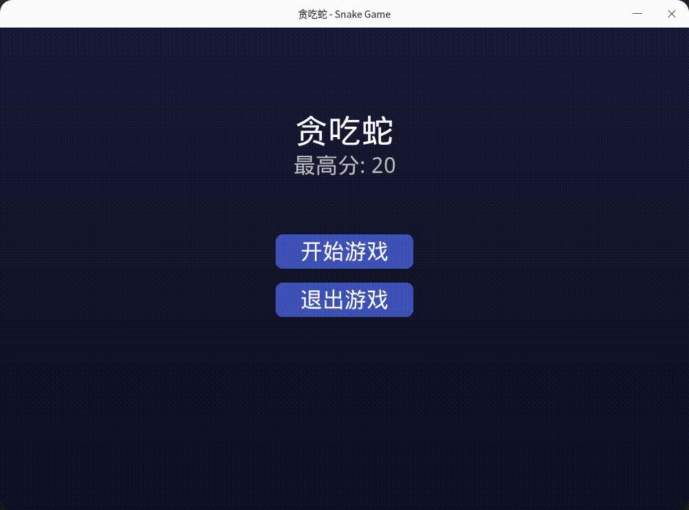

# SnakeGame (贪吃蛇游戏)

The implementation of the Snake game using the pygame module in Python.  
It is divided into a multiplayer online version and a single-player offline version.  
(贪吃蛇游戏，python的pygame模块实现)  
(分为多人在线版本和单人离线版本)

### Detailed Introduction (详细介绍)

The code has been supplemented with very detailed comments. Please read the comments.  
(代码增加了非常详细的注释，请阅读注释)

# Dependencies Install (依赖安装)

If you are using code to run, you need to execute the following command first to install the dependencies.  
(如果您是通过代码来运行的，那么首先需要执行以下命令来安装相关依赖项。)  
`pip install -r requirements.txt`

# Run (运行)

### Single-player offline version (单机版)

`python snake_game.py`

### Multiplayer online version (多人在线版本)

Server (服务端)：`python ol_server.py`  
Client (Game) (客户端(游戏端)): `python snake_game_ol.py`

# Preview (预览)

### Single-player offline version preview (单机版)

### Multiplayer online version preview (多人在线版本)

# License (授权许可)

**MIT License**

**请保留License内容，并注明来源**  
项目主要用于启蒙式编程进阶内容教学，当然你也可以用于任何合法用途。

**Please retain the License content and include the source.**  
The project is mainly used for teaching advanced content of introductory programming. Of course, you can also use it for any legal purposes.  